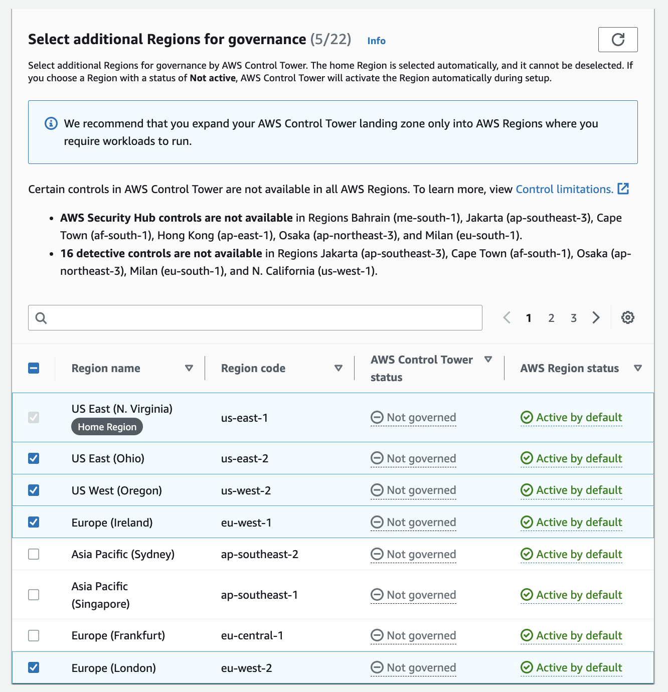

# Control Tower AFT Bootstrap
Deploys an AWS Organization and AWS Control Tower AFT (Account Factory for Terraform).

The bootstrap steps performed below are defined in the AWS-maintained repo [Terraform AWS Control Tower Account Factory](https://github.com/aws-ia/terraform-aws-control_tower_account_factory/tree/main#configure-and-launch-your-aws-control-tower-account-factory-for-terraform).


### 1. Setup AWS Management account
AWS Control Tower Requires a standalone AWS account in order to configure AWS Organizations/ Control Tower.

Set your AWS SSO profile & region locally to configure the following resources. E.g.:
```sh
export AWS_DEFAULT_PROFILE=123_abc
export AWS_DEFAULT_REGION=us-east-1
```

### 2. Create S3 Bucket for Terraform Backend
Instructions to manually create a secure AWS S3 bucket via AWS CLI, to be used as the first Terraform backend.

Create S3 Bucket (object-lock enabled):
```sh
aws s3api create-bucket --bucket anuj-tfbackend --object-lock-enabled-for-bucket
```

***Since April 2023, S3 Public Access Block is enabled by default.***

### 3. Bootstrap OUs and AWS Accounts
```sh
terraform init -backend-config=./backends/finops.backend
terraform plan -var-file=./tfvars/prod.tfvars
```

### 4. Enable AWS Control Tower Landing Zone

* Launch your AWS Control Tower landing zone in `us-east-1`:


* Set home region:


* Enabled deny region setting:


* Select regions to enable:



* Configure OUs:


### 5. Deploy AFT

See: https://github.com/aws-ia/terraform-aws-control_tower_account_factory/tree/main#configure-and-launch-your-aws-control-tower-account-factory-for-terraform

### 6. Post Deployment

* manually sign in to the AFT management account’s console to complete the pending AWS CodeStar connection. See [the AWS CodeStar documentation](https://docs.aws.amazon.com/dtconsole/latest/userguide/connections-update.html) for further instructions on completing the AWS CodeStar connection.


## Terraform Docs

<!-- BEGINNING OF PRE-COMMIT-TERRAFORM DOCS HOOK -->
## Requirements

| Name | Version |
|------|---------|
| <a name="requirement_terraform"></a> [terraform](#requirement\_terraform) | >= 1.4.6 |
| <a name="requirement_aws"></a> [aws](#requirement\_aws) | >= 4.67.0 |

## Providers

| Name | Version |
|------|---------|
| <a name="provider_aws"></a> [aws](#provider\_aws) | 4.67.0 |

## Modules

| Name | Source | Version |
|------|--------|---------|
| <a name="module_aft"></a> [aft](#module\_aft) | github.com/aws-ia/terraform-aws-control_tower_account_factory | 1.10.3 |

## Resources

| Name | Type |
|------|------|
| [aws_organizations_organization.org](https://registry.terraform.io/providers/hashicorp/aws/latest/docs/resources/organizations_organization) | resource |
| [aws_organizations_organizational_unit.aft_management](https://registry.terraform.io/providers/hashicorp/aws/latest/docs/resources/organizations_organizational_unit) | resource |
| [aws_organizations_organizational_units.root](https://registry.terraform.io/providers/hashicorp/aws/latest/docs/data-sources/organizations_organizational_units) | data source |

## Inputs

| Name | Description | Type | Default | Required |
|------|-------------|------|---------|:--------:|
| <a name="input_admin_profile"></a> [admin\_profile](#input\_admin\_profile) | AWS profile used to bootstrap the AWS Organization for Control Tower | `string` | n/a | yes |
| <a name="input_allowed_account_ids"></a> [allowed\_account\_ids](#input\_allowed\_account\_ids) | list of allowed AWS account IDs to prevent you from mistakenly using an incorrect one | `list(string)` | n/a | yes |
| <a name="input_ct_management_account_id"></a> [ct\_management\_account\_id](#input\_ct\_management\_account\_id) | AWS Control Tower Management account ID | `string` | n/a | yes |
| <a name="input_region"></a> [region](#input\_region) | default AWS region | `string` | `"us-east-1"` | no |

## Outputs

No outputs.
<!-- END OF PRE-COMMIT-TERRAFORM DOCS HOOK -->
