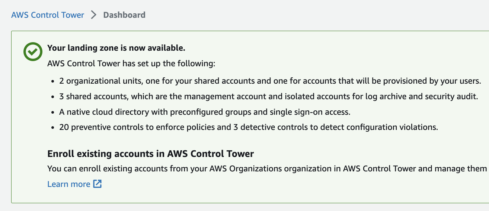

# AWS Control Tower Landing Zone (AFT)
Deploys an AWS Organization using AWS Control Tower AFT (Account Factory for Terraform).

Approximate cost breakdown:
```
Total Monthly Cost:        176.4552 USD
```

The bootstrap steps performed below are defined in the AWS-maintained repo [Terraform AWS Control Tower Account Factory](https://github.com/aws-ia/terraform-aws-control_tower_account_factory/tree/main#configure-and-launch-your-aws-control-tower-account-factory-for-terraform).


### 1. Setup AWS Management account
AWS Control Tower Requires a standalone AWS account in order to configure AWS Organizations/ Control Tower.

Set your AWS SSO profile & region locally to configure the following resources. E.g.:
```sh
export AWS_DEFAULT_PROFILE=123_abc
export AWS_DEFAULT_REGION=us-east-1
```

### 2. Enable AWS Control Tower Landing Zone

* Launch your AWS Control Tower landing zone in `us-east-1`:


* Set home region:


* Enabled deny region setting:


* Select regions to enable:


* Configure OUs:


* Setup additional required accounts:


* Enable CloudTrail:


* Success:




### 3. Create S3 Bucket for Terraform Backend
Instructions to manually create a secure AWS S3 bucket via AWS CLI, to be used as the first Terraform backend.

Create S3 Bucket (object-lock enabled):
```sh
aws s3api create-bucket --bucket anuj-tfbackend --object-lock-enabled-for-bucket
```

***Since April 2023, S3 Public Access Block is enabled by default.***

### 4. Bootstrap OUs and AWS Accounts

#### Input Variables file

Using variables and account IDs from Control Tower, complete variables file at `./tfvars/prod.tfvars`:
```
admin_profile                = ""
allowed_account_ids          = [""]
ct_management_account_id     = ""
log_archive_account_id       = ""
audit_account_id             = ""
aft_management_account_email = ""
```

#### Backend Config file
Complete the backend config at `./backends/finops.backend.tfvars`:
```
profile = "123_abc"
key     = "xyz-aft"
bucket  = "example-tfbackend"
region  = "us-east-1"
```

#### Deploy

```sh
terraform init -backend-config=./backends/finops.backend.tfvars
terraform apply -var-file=./tfvars/prod.tfvars
```

AFT Module: https://github.com/aws-ia/terraform-aws-control_tower_account_factory/tree/main#configure-and-launch-your-aws-control-tower-account-factory-for-terraform

### 6. Post Deployment

https://docs.aws.amazon.com/controltower/latest/userguide/aft-post-deployment.html

1. manually enroll `AFT-Management` Organizational Unit:


2. Create the 4 new Github repos based on the starting content from the 4 folders under: https://github.com/aws-ia/terraform-aws-control_tower_account_factory/tree/main/sources/aft-customizations-repos

3. manually sign in to the AFT management account’s console, and `Update pending connection` under [AWS CodeStar connections](https://us-east-1.console.aws.amazon.com/codesuite/settings/connections?region=us-east-1) from the right region, and configure the Github Integration to read all 4 new repos.

https://docs.aws.amazon.com/dtconsole/latest/userguide/connections-update.html


## Terraform Docs

<!-- BEGINNING OF PRE-COMMIT-TERRAFORM DOCS HOOK -->
## Requirements

| Name | Version |
|------|---------|
| <a name="requirement_terraform"></a> [terraform](#requirement\_terraform) | >= 1.4.6 |
| <a name="requirement_aws"></a> [aws](#requirement\_aws) | >= 4.67.0 |

## Providers

| Name | Version |
|------|---------|
| <a name="provider_aws"></a> [aws](#provider\_aws) | 4.67.0 |

## Modules

| Name | Source | Version |
|------|--------|---------|
| <a name="module_aft"></a> [aft](#module\_aft) | github.com/aws-ia/terraform-aws-control_tower_account_factory | 1.10.3 |

## Resources

| Name | Type |
|------|------|
| [aws_organizations_account.aft](https://registry.terraform.io/providers/hashicorp/aws/latest/docs/resources/organizations_account) | resource |
| [aws_organizations_organizational_unit.aft_management](https://registry.terraform.io/providers/hashicorp/aws/latest/docs/resources/organizations_organizational_unit) | resource |
| [aws_organizations_organization.org](https://registry.terraform.io/providers/hashicorp/aws/latest/docs/data-sources/organizations_organization) | data source |
| [aws_organizations_organizational_units.root](https://registry.terraform.io/providers/hashicorp/aws/latest/docs/data-sources/organizations_organizational_units) | data source |

## Inputs

| Name | Description | Type | Default | Required |
|------|-------------|------|---------|:--------:|
| <a name="input_admin_profile"></a> [admin\_profile](#input\_admin\_profile) | AWS profile used to bootstrap the AWS Organization for Control Tower | `string` | n/a | yes |
| <a name="input_aft_management_account_email"></a> [aft\_management\_account\_email](#input\_aft\_management\_account\_email) | Account Factory for Terraform management account email address | `string` | n/a | yes |
| <a name="input_allowed_account_ids"></a> [allowed\_account\_ids](#input\_allowed\_account\_ids) | list of allowed AWS account IDs to prevent you from mistakenly using an incorrect one | `list(string)` | n/a | yes |
| <a name="input_audit_account_id"></a> [audit\_account\_id](#input\_audit\_account\_id) | Auditing account ID | `string` | n/a | yes |
| <a name="input_ct_home_region"></a> [ct\_home\_region](#input\_ct\_home\_region) | Control Tower home AWS region | `string` | `"us-east-1"` | no |
| <a name="input_ct_management_account_id"></a> [ct\_management\_account\_id](#input\_ct\_management\_account\_id) | AWS Control Tower Management account ID | `string` | n/a | yes |
| <a name="input_log_archive_account_id"></a> [log\_archive\_account\_id](#input\_log\_archive\_account\_id) | Log Archive account ID | `string` | n/a | yes |
| <a name="input_tf_backend_secondary_region"></a> [tf\_backend\_secondary\_region](#input\_tf\_backend\_secondary\_region) | Secondary region to replicate the AFT backend | `string` | `"us-west-1"` | no |

## Outputs

| Name | Description |
|------|-------------|
| <a name="output_aft_management_account_id"></a> [aft\_management\_account\_id](#output\_aft\_management\_account\_id) | n/a |
<!-- END OF PRE-COMMIT-TERRAFORM DOCS HOOK -->
